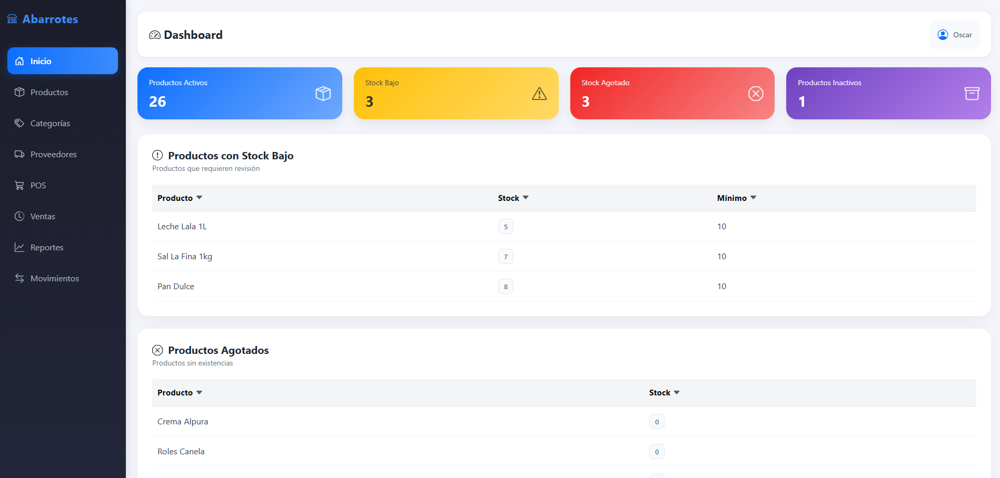
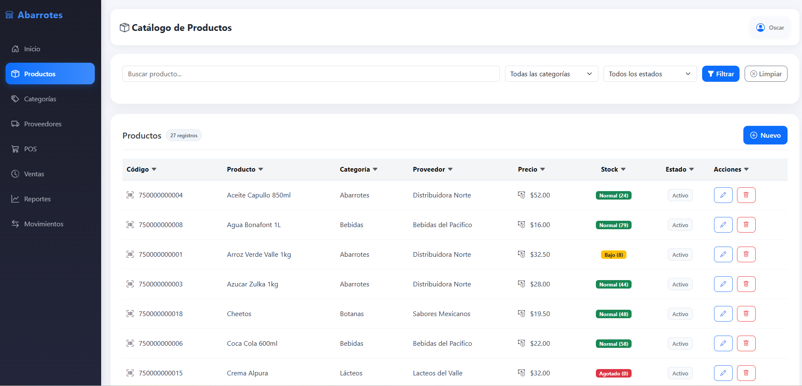
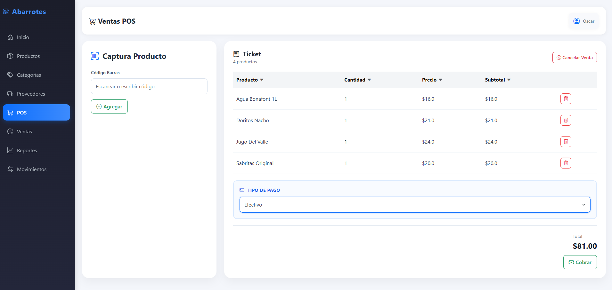
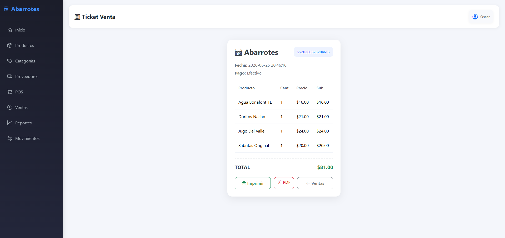
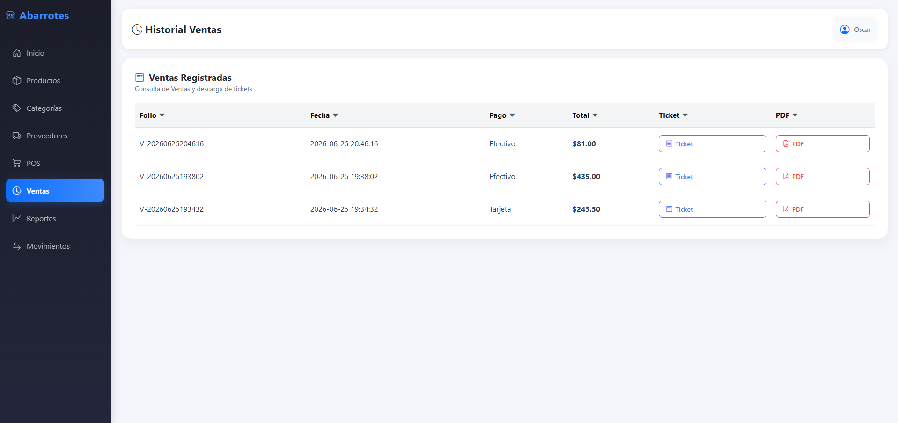
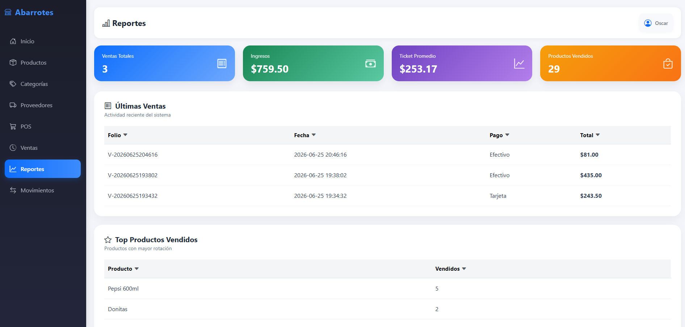
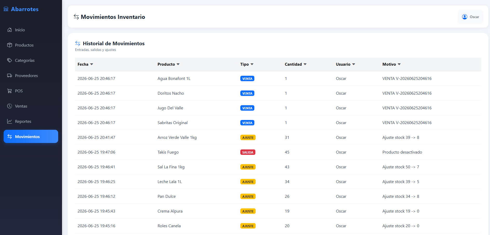

# Sistema de Inventario y Punto de Venta para Abarrotes

Aplicación web para llevar el control de un negocio de abarrotes. Permite registrar productos, categorías, proveedores, ventas y ver el estado del inventario desde un mismo lugar.

Este proyecto forma parte de mi proceso de aprendizaje como desarrollador backend con Python. Lo fui construyendo mientras practicaba Flask, bases de datos, lógica de negocio y diseño de interfaces simples y funcionales.

---

## Objetivo

Desarrollar una solución funcional para pequeños negocios de abarrotes que permita:

* Controlar inventario en tiempo real.
* Gestionar productos y proveedores.
* Registrar ventas mediante un Punto de Venta (POS).
* Mantener trazabilidad de movimientos de inventario.
* Visualizar indicadores clave del negocio.

---

## Tecnologías Utilizadas

### Backend

* Python
* Flask
* Jinja2

### Base de Datos

* MySQL

### Frontend

* HTML5
* CSS3
* Bootstrap 5
* Bootstrap Icons

### Control de Versiones

* Git
* GitHub

### Despliegue

* Render

---

## Funcionalidades Implementadas

### Dashboard

* Indicadores principales del sistema.
* KPI de productos agotados.
* KPI de productos inactivos.
* Resumen visual del inventario.

### Productos

* Alta de productos.
* Edición de productos.
* Activación y desactivación lógica.
* Control de stock.
* Validación de códigos de barras duplicados.

### Categorías

* Alta y edición de categorías.
* Validación de categorías duplicadas.
* Restricción de longitud de nombre.
* Validación de campos obligatorios.

### Proveedores

* Alta y edición de proveedores.
* Validación de proveedores duplicados.
* Validación de teléfono numérico.
* Restricción de longitud de campos.

### Punto de Venta (POS)

* Captura de productos por código de barras.
* Carrito de compra.
* Cálculo automático de totales.
* Selección de tipo de pago.
* Prevención de doble venta por múltiples clics.

### Ventas

* Historial de ventas.
* Consulta de operaciones registradas.

### Movimientos de Inventario

* Registro automático de entradas.
* Registro automático de ventas.
* Registro automático de ajustes de stock.
* Historial completo de movimientos.

### Reportes

* Visualización de indicadores operativos.
* Seguimiento del estado del inventario.

---

## Diseño Responsive

El sistema fue optimizado para múltiples dispositivos:

### Escritorio

* Sidebar lateral completo.

### Tablet (iPad)

* Tablas responsivas.
* Adaptación de botones y controles.
* Optimización de formularios.

### Móvil

* Menú inferior de navegación.
* Scroll horizontal para acceso a todos los módulos.
* Indicador visual de sección activa.
* Diseño adaptado a pantallas pequeñas.

---

## Principales Aprendizajes

Durante el desarrollo de este proyecto se trabajó en:

* Arquitectura modular con Flask.
* Diseño de bases de datos relacionales.
* Consultas SQL y validaciones.
* Desarrollo de interfaces web.
* Diseño responsive.
* Control de versiones con Git y GitHub.
* Despliegue de aplicaciones web en la nube.
* Resolución de errores en producción.

---

## Estado del Proyecto

Versión actual: 1.0

Funcional y desplegada en la nube para pruebas operativas.

---
## Estructura del proyecto

La aplicación está organizada de forma simple:

- app/: lógica principal del sistema
- app/routes/: rutas de la interfaz
- app/services/: reglas y operaciones del negocio
- app/templates/: páginas HTML
- app/static/: archivos de estilo y recursos
- docs/images/: capturas de la aplicación

---
## Vista previa de la aplicación

### Inicio
Panel principal con indicadores clave para el control del inventario.

### Productos
Gestión del catálogo de productos con información de precio, stock y estado.

### Punto de Venta
Punto de venta para registrar compras mediante código de barras y tipo de pago.

### Ticket
Ticket de compra con detalle de productos, cantidades y total de la venta.

### Ventas de Venta
Historial de ventas registradas para consulta y seguimiento de operaciones.

### Reportes
Panel de reportes con indicadores para apoyar el análisis del negocio.

### Movimientos
Historial de entradas, ventas y ajustes para mantener la trazabilidad del inventario.

---

## Próximas Funcionalidades

* Sistema de usuarios y autenticación.
* Roles y permisos.
* Exportación a Excel.
* Escaneo avanzado de códigos de barras.
* Reportes avanzados.

---

## ¿Qué aprendí con este proyecto?

Este proyecto comenzó como una práctica para reforzar mis conocimientos en Flask y terminó convirtiéndose en una aplicación web completa con gestión de inventario, ventas y reportes. Durante el desarrollo aprendí a estructurar aplicaciones por módulos, trabajar con MySQL, implementar validaciones, diseñar interfaces responsivas, utilizar Git y GitHub para el control de versiones y desplegar aplicaciones en Render.

## Autor

Oscar Espinosa Torres

Desarrollador backend en formación.

